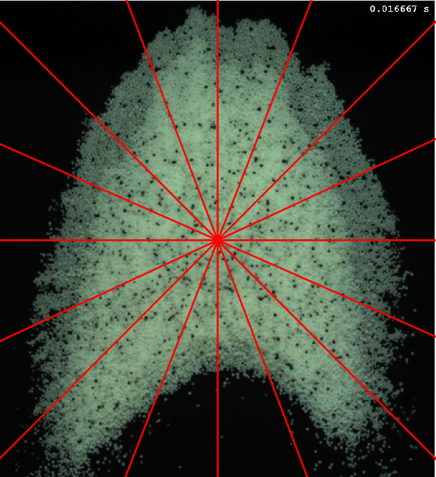

# About: 

  This code was developed during my master degree at Unicamp University in Brazil, under the supervision of my advisor: Erick de Moraes Franklin. The aim of this work was to know the velocity of grains over a barchan dune, applying a Eulerian and Lagrangian approach. To do that, experiments were made and recorded, generating around 3000 pictures for each test. This code was developed to process these images, and as a result, it returns 4 kinds of graphics and a table for the Eulerian and Lagrangian approach, respectively.
  
  Observation: the three folders in the repository are versions of the same code. The names "Black" and "White" refers to the color of the dune (black: 98% of grains are black and 2% are white (tracers), white: the opposite), and "RGB" and "GrayScale" refers to the file format.
  

  

