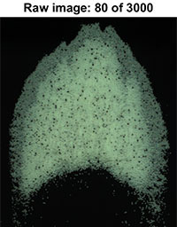
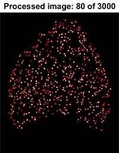

# About:

  This code was developed during my master degree at Unicamp University in Brazil, under the supervision of my advisor: Erick de Moraes Franklin. The aim of this work was to know the velocity of grains over a barchan dune, applying a Eulerian and Lagrangian approach. To do that, experiments were made and recorded, generating around 3000 pictures for each test. This code was developed to process these images, and as a result, it returns 4 kinds of graphics and a table for the Eulerian and Lagrangian approach, respectively.
  
  Note: the three folders in the repository are versions of the same code. The names "Black" and "White" refers to the color of the dune (black: 98% of grains are black and 2% are white (tracers), white: the opposite), and "RGB" and "GrayScale" refers to the file format.


  White_RGB             |  Black_RGB             |  White_GrayScale
:-------------------------:|:-------------------------:|:-------------------------:
  |    |  


# How do I use it?
## Step 1 

Set the variables in the main function (White_RGB = allposXY, Black_RGB = B_allposXY and White_GrayScale = N_allposXY): 


```
%***********************************************************************************************
frequency_T1 = 300;         % Frequency of image acquisition
n_T1 = 1;                   % Initial image
nf_T1 = 3000;               % Final image
threshold_T1 = 250;         % Threshold to differentiate the grains and the bottom wall of the channel
arealim_T1 = [3 150];       % Determine the lower and upper bound of area of each grain (Pixels)
MD2SF_T1 = 37.4519;         % Maximum distance to search for the same grain in the next image (Pixels)
MinTS_T1 = 101.4339;        % Minimal tracking size to consider in lagrangian (Pixels)
deltaY_T1 = 2;              % deltaY & speedY are used to determine and filter the tracking,in order to get just the time when the particle is in movement...
speedY_T1 = 0.6;            % disregarding the time in which it remains stopped
height = 1024;              % Image height (Pixels)
width = 800;                % Image width (Pixels)
step_T1 = 1;                % Here is possible to choose the gap between the images. Ex. if step == 1: image n°1->n°2; n°2->n°3; n°3->n°4... if step == 2: image n°1->n°3; n°2->n°4; n°3->n°5 ans so on...         
mesh_T1 = 25;               % Determine the mesh size that will be generated on the image
median2cut_T1 = 2;          % Used in filter, if the element of the mesh has lees than "meanEleXY"(amount of images that has valid movement in each element of mesh) times "minEl2verify"(given in %) elements,                                                          
MinEl2VrPercent_T1 = 27;    % the filter calculates the median value arround this element, and if it's value is greater than "median2cut" times the median value it is replaced by the median value
P2MM = 0.0992906802568982;  % Pixel to milimeter conversion factor
%***********************************************************************************************
```

Note: For the mesh variable, there are some values in the code ready to be used:

- AllposXY: 25 (best in my case), 50 and 100.
- B_AllposXY: 25 (best in my case), 50 and 100.
- N_AllposXY: 25, 35.5823 (best in my case), 50 and 100.

If you need another mesh size, you need to change the "spiral" function. If you have problems with this, let me know so I can help you.

## Step 2

Use the following "for" of the main function:


```
for m = n_T1:nf_T1
    clf
    time_T1 = (m-1)*time_img_T1;
    Iname = lst(m);
    I = imread([Iname.name]);
    [inverter] = Inverter(I);  % This function reverses the image to make the tracers white
    [pos,props,Area] = TracerIdentifier(inverter,threshold_T1,arealim_T1);
    posx = pos(:,1);
    posy = pos(:,2);
    [limit] = Limit(I);
    allposXY_T1{1,m} = posx;   % Position on the x-axis of each tracer grain detected in the image
    allposXY_T1{2,m} = posy;   % Position on the y-axis of each tracer grain detected in the image
    allposXY_T1{3,m} = limit;  % Central point of dune slip face
    allposXY_T1{4,m} = Area;   % Area of each tracer grain detected in the image
    subplot(1,2,1)
    imshow(I)    
    title([' Raw Image ',num2str(m),' of ',num2str(nf_T1)])
    subplot(1,2,2)
    imshow(inverter)    
    title(['Processed Image ',num2str(m),' of ',num2str(nf_T1)])
    hold on
    plot(posx,posy,'ro')
    pause(0.001)
end
```


and adjust the "threshold" and "arealim" variables to obtain good tracers positions identification:


  White_RGB_Raw             |  White_RGB_Processed            
:-------------------------:|:-------------------------:
  |    


