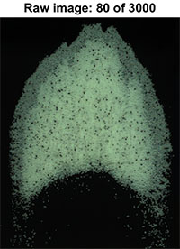
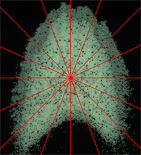

# About:

  This code was developed during my master degree at Unicamp University in Brazil, under the supervision of my advisor: Erick de Moraes Franklin. The aim of this work was to know the velocity of grains over a barchan dune, applying a Eulerian and Lagrangian approach. To do that, experiments were made and recorded, generating around 3000 pictures for each test. This code was developed to process these images, and as a result, it returns 4 kinds of charts and a table for the Eulerian and Lagrangian approach, respectively.

<br />
  
  
<p align="center">

</p>

  
  Note: the three folders in the repository are versions of the same code. The names "Black" and "White" refers to the color of the dune (black: 98% of grains are black and 2% are white (tracers), white: the opposite), and "RGB" and "GrayScale" refers to the file format
                                                                                                            
<br />


  White_RGB             |  Black_RGB             |  White_GrayScale
  :-------------------------:|:-------------------------:|:-------------------------:
    |    |  


# How do I use it?
## Step 1 

Set the variables in the main function `White_RGB` = `AllposXY`, `Black_RGB` = `B_AllposXY` and `White_GrayScale` = `N_AllposXY`:

 
```
%***********************************************************************************************
frequency_T1 = 300;         % Frequency of image acquisition
n_T1 = 1;                   % Initial image
nf_T1 = 3000;               % Final image
threshold_T1 = 250;         % Threshold to differentiate the grains and the bottom wall of the channel
arealim_T1 = [3 150];       % Determine the lower and upper bound of area of each grain (Pixels)
MD2SF_T1 = 37.4519;         % Maximum distance to search for the same grain in the next image (Pixels)
MinTS_T1 = 101.4339;        % Minimal tracking size to consider in lagrangian (Pixels)
deltaY_T1 = 2;              % deltaY & speedY are used to determine and filter the tracking,in order to get just the time when the particle is in movement...
speedY_T1 = 0.6;            % disregarding the time in which it remains stopped
height = 1024;              % Image height (Pixels)
width = 800;                % Image width (Pixels)
step_T1 = 1;                % Here is possible to choose the gap between the images. Ex. if step == 1: image n°1->n°2; n°2->n°3; n°3->n°4... if step == 2: image n°1->n°3; n°2->n°4; n°3->n°5 ans so on...         
mesh_T1 = 25;               % Determine the mesh size that will be generated on the image
median2cut_T1 = 2;          % Used in filter, if the element of the mesh has lees than "meanEleXY"(amount of images that has valid movement in each element of mesh) times "minEl2verify"(given in %) elements,                                                          
MinEl2VrPercent_T1 = 27;    % the filter calculates the median value arround this element, and if it's value is greater than "median2cut" times the median value it is replaced by the median value
P2MM = 0.0992906802568982;  % Pixel to milimeter conversion factor
%***********************************************************************************************
```

Note: For the mesh variable, there are some values in the code ready to be used:

- AllposXY: 25 (best in my case), 50 and 100.
- B_AllposXY: 25 (best in my case), 50 and 100.
- N_AllposXY: 25, 35.5823 (best in my case), 50 and 100.

If another mesh size is required, you must implement it in the "spiral" function. If you have problems with this, let me know so I can help you.

## Step 2

Use the following "for" of the main function:


```
for m = n_T1:nf_T1
    clf
    time_T1 = (m-1)*time_img_T1;
    Iname = lst(m);
    I = imread([Iname.name]);
    [inverter] = Inverter(I);  % This function reverses the image to make the tracers white
    [pos,props,Area] = TracerIdentifier(inverter,threshold_T1,arealim_T1);
    posx = pos(:,1);
    posy = pos(:,2);
    [limit] = Limit(I);
    allposXY_T1{1,m} = posx;   % Position on the x-axis of each tracer grain detected in the image
    allposXY_T1{2,m} = posy;   % Position on the y-axis of each tracer grain detected in the image
    allposXY_T1{3,m} = limit;  % Central point of dune slip face
    allposXY_T1{4,m} = Area;   % Area of each tracer grain detected in the image
    subplot(1,2,1)
    imshow(I)    
    title([' Raw Image ',num2str(m),' of ',num2str(nf_T1)])
    subplot(1,2,2)
    imshow(inverter)    
    title(['Processed Image ',num2str(m),' of ',num2str(nf_T1)])
    hold on
    plot(posx,posy,'ro')
    pause(0.001)
end
```


and adjust the "threshold" and "arealim" variables to obtain good tracers positions identification:  
<br />


 White_RGB_Raw             |  White_RGB_Processed            
:-------------------------:|:-------------------------: 
  |    

  ## Step 3 
  
Go to `FiguresAndPlots` function, choose your directory `dir`, and the file format `saveas ... 'File Format'` .  

```
        dir = 'INSERT YOUR DIRECTORY HERE\T(number of your test)_quiver';
        figure,
        quiver(XX,YY,velX2_mean,velY2_mean,1.1);    
        set(gca,'Ydir','reverse')
        set(gca,'FontSize',16)
        xlim([0 80])
        ylim([0 100])
        xticks([0 10 20 30 40 50 60 70 80])
        yticks([0 10 20 30 40 50 60 70 80 90 100])
        xlabel ('x ($mm$)','FontSize',16)
        ylabel ('y ($mm$)','FontSize',16)
        saveas(gcf,strcat(dir), 'epsc');
        saveas(gcf,strcat(dir), 'jpeg');
```

Note: Do this for the four kinds of graphs.

## Step 4

Run the main function and analyze the results.

Eulerian approach: If the graphs are presenting some inconsistency is possible to increase the action of the `Filter` function adjusting the variables: `median2cut` and `MinEl2VrPercent`. The variable `changeXYpercent` gives the number (in %) of mesh elements that were modified by the `Filter` function.

Lagrangian Approach: You can adjust the `MinTS` variable to define the minimum valid tracking size. It is also possible to adjust the `deltaY` and `speedY` variables to determine the moment when the particle starts and ends the motion.

The variable `MD2SF` influences both approaches. It is the maximum distance that the code uses to search for the same grain in the next image (one of the filters, see more inside the `Pair` function). It is recommended to test values around 50% of the distance traveled by the flow between two images.

# Results

## Eulerian approch
  
  In order to show the results obtained with the Eulerian approach, the code generates 3 different mesh stiles, allowing to generate 4 types of graphics, providing a wide analysis of the velocity of the grains over a barchan dune.
  
  ### Mesh
  #### Cartesian mesh
  
  <p align="center">
  
  </p>
  
  You can adjust the mesh size by changing the variable `mesh` in the main function.
 
 Note: All the results shown in the following charts are spatial and temporal mean velocities of the grains (represented by < v >), inside each mesh element and through all images, respectively. 
 
 
  ##### Charts
   
 <br />
 
   Quiver            |  Contourf            
:-------------------------:|:-------------------------: 
  |   

<br />

These two charts show the main direction of the grains displacement and the magnitude of its velocity in each region of the dune. In both cases, the dune centroid is plotted in the central point of the chart, and the abscissa and ordinate correspond, respectively, to the transverse (x) and longitudinal (y) coordinates.

 #### Radial mesh & chart
  
 <br />
  
  Radial mesh            |  Histogram           
:-------------------------:|:-------------------------: 
  |   

 <br />

This chart presents the mean velocity as functions of the radial position r (with origin at the dune centroid).  In this figure, the abscissa corresponds to the radial position, the ordinate to the magnitude of the velocity vector, and the width of bars to the interval between the considered radial positions.

#### Angular mesh & chart

<br />

  Angular mesh           |  Polar histogram           
:-------------------------:|:-------------------------: 
  |   

<br />

This chart presents the mean velocity as a function of the angle with respect to the transverse direction. In this figure, the numbers along the perimeter correspond to angles with respect to the transverse
direction (the water flow direction is 270◦) and the height of
bars to the magnitude of velocity, which can be measured
using the radial scale along the 80◦ line.


## Eulerian approch

In this approach, each grain is followed while still visible in the image. The code detects the time when the particle is in movement, disregarding the time in which it remains stopped. As a result, it returns an array containing the mean of the transverse (x) and longitudinal (y) distances and velocities of all valid trackings. Besides that, it gives the standard deviations of distances and velocities for both axes.
 
 ### Example of lagrangian results
 
 Mean dist.(x) | Mean dist.(y)|Std. of dist.(x) |Std. of dist.(y) |Mean vel.(x) |Mean vel.(y) |Std. of vel.(x) | Std. of vel.(y)
:--:|:--:|:--:|:--:|:--:|:--:|:--:|:--:
0,07|17,58| 4,22|15,29 |0,44|71,39 |18,91 |37,30 

Note: Distances are given in "mm" and velocities in "mm/s".
		
## Charts	

  Angular mesh           |  Polar histogram           
:-------------------------:|:-------------------------: 
  |   
